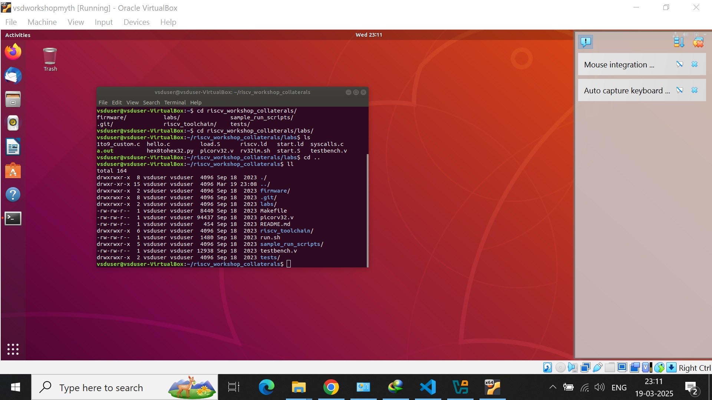

# RISCV-MYTH

- Follow VSDSquadronFMDatasheet.pdf and follow instructions
    - Download vdi file https://forgefunder.com/~kunal/vsd_workshop.vdi
    - Install Oracle Virtualbox https://www.virtualbox.org/wiki/Downloads
- Progress doc 
    - https://docs.google.com/spreadsheets/d/1GMimG56cLoMpC9Us7Ub7hMD22D16zcsfcVL7WmjurcE/edit?gid=0#gid=0

Course Videos

     
    https://github.com/pkalyankumar1010/RISCV-MYTH-Course-Videos

- TASK 0 
    - Created lab setup with OracleVirtual box and risv_workshop.vdi
    - 
- Day 1
    - 