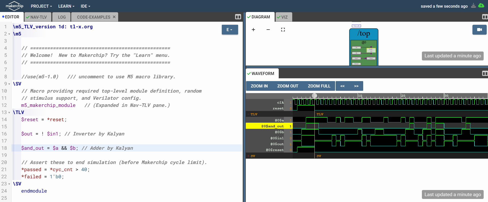
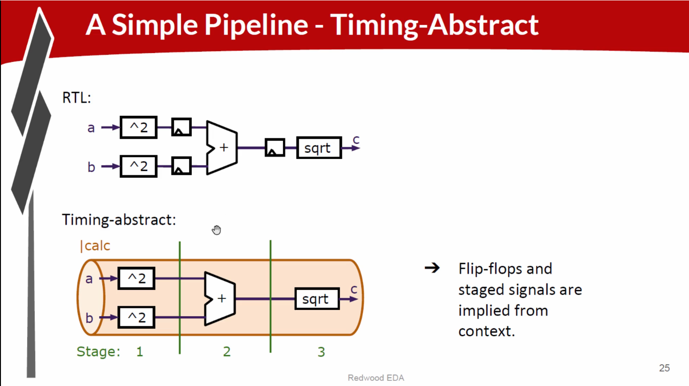
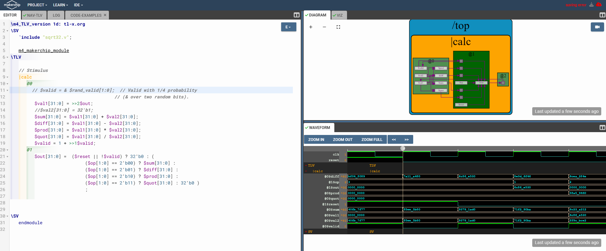

# RISCV-MYTH


- Follow VSDSquadronFMDatasheet.pdf and follow instructions
    - Download vdi file https://forgefunder.com/~kunal/riscv_workshop.vdi
    - Install Oracle Virtualbox https://www.virtualbox.org/wiki/Downloads
- Progress doc 
    - https://docs.google.com/spreadsheets/d/1GMimG56cLoMpC9Us7Ub7hMD22D16zcsfcVL7WmjurcE/edit?gid=0#gid=0

<details close>
<summary>Course Videos</summary>
    <br>
    <span>https://github.com/pkalyankumar1010/RISCV-MYTH-Course-Videos</span>
</details>

# **Day 0**
- Created lab setup with OracleVirtual box and risv_workshop.vdi
- 
# **Day 1**
    - 
# **Day 2**
    - 
# **Day 3**
- https://github.com/stevehoover/RISC-V_MYTH_Workshop?tab=readme-ov-file

## Buiding a RISCV-Core [🔝](#riscv-myth)
- [Digital logic with TL-verilog in Makerchip IDE](#digital-logic-with-tl-verilog-in-makerchip-ide)
- [Coding a RISC-V CPU Subset](#coding-a-risc-v-cpu-subset)
- [Pipelining and Completing your CPU](#pipelining-and-completing-your-cpu)

### Digital logic with TL-verilog in Makerchip IDE
- TL-verilog is extension of verilog called Transaction Level Verilog
- Topics
    - Logic gates
    - Makerchip platform
    - Combinational logic
    - Seqential logic
    - Pipelined logic
    - State
- Resources
    - https://github.com/stevehoover/RISC-V_MYTH_Workshop?tab=readme-ov-file

- Logic gates
    - 
- And some other basic things
- Launching Makerchip 
- Lab : Combinational logic
    - 
    - https://makerchip.com/sandbox/0Z6fMhxVk/02Rhp0Q
- Lab : Vector
    - 
- Lab : Mux
    - 
- Lab : Comninational Calcualtor
    - 
- Lab : Counter
    - `>>1$num` mean 1 clock cycle before value f(t-1)
    - 
    - 
- Lab : Sequential Calculator
    - 
    - 

    - ```v
        $val1[31:0] = >>1$out;
        //$val2[31:0] = 32'b1;
        $sum[31:0] = $val1[31:0] + $val2[31:0];
        $diff[31:0] = $val1[31:0] - $val2[31:0];
        $prod[31:0] = $val1[31:0] * $val2[31:0];
        $quot[31:0] = $val1[31:0] / $val2[31:0];
        $out[31:0] =  $reset ? 32'b0 : (
                            ($op[1:0] == 2'b00) ? $sum[31:0] :
                            ($op[1:0] == 2'b01) ? $diff[31:0] :
                            ($op[1:0] == 2'b10) ? $prod[31:0] :
                            ($op[1:0] == 2'b11) ? $quot[31:0] : 32'b0 )
                            ;
        ```
- Lab : pipelined logic
    - To split multi operations to multi clock cycles
    - TL vrilog coding will be easier for pipleining
    - we dont need to manually insert buffers it inserts automatically
    - 
    - 
    - 
    - 
    - Implementing pipelining in verilog is difficult and error prone
- Idenifiers and Types
    - 
- Lab : Pipeline
    - 
- Lab : Counter and Calculator in Pipeline
    - 
    - ```v
            // Stimulus
        |calc
            @0
                // $valid = & $rand_valid[1:0];  // Valid with 1/4 probability
                                            // (& over two random bits).
                $val1[31:0] = >>2$out;
                //$val2[31:0] = 32'b1;
                $sum[31:0] = $val1[31:0] + $val2[31:0];
                $diff[31:0] = $val1[31:0] - $val2[31:0];
                $prod[31:0] = $val1[31:0] * $val2[31:0];
                $quot[31:0] = $val1[31:0] / $val2[31:0];
                $valid = 1 + >>1$valid;
            @1
                $out[31:0] =  ($reset || !$valid) ? 32'b0 : (
                                    ($op[1:0] == 2'b00) ? $sum[31:0] :
                                    ($op[1:0] == 2'b01) ? $diff[31:0] :
                                    ($op[1:0] == 2'b10) ? $prod[31:0] :
                                    ($op[1:0] == 2'b11) ? $quot[31:0] : 32'b0 )
                                    ```
- Validity
    - Run our circuit when only inputs are valid
    - Acts as clock gating logic also
    - ? is when condition
    - 
    - 
- Should start with DAY4 1st video Tomorrow
### Coding a RISC-V CPU Subset

### Pipelining and Completing your CPU
